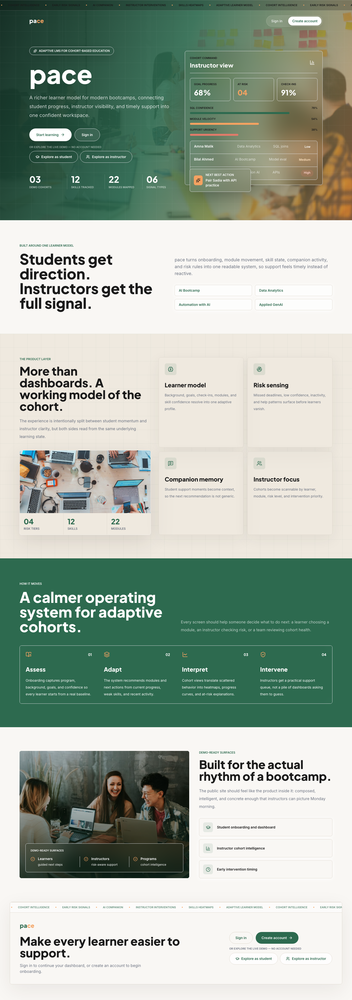
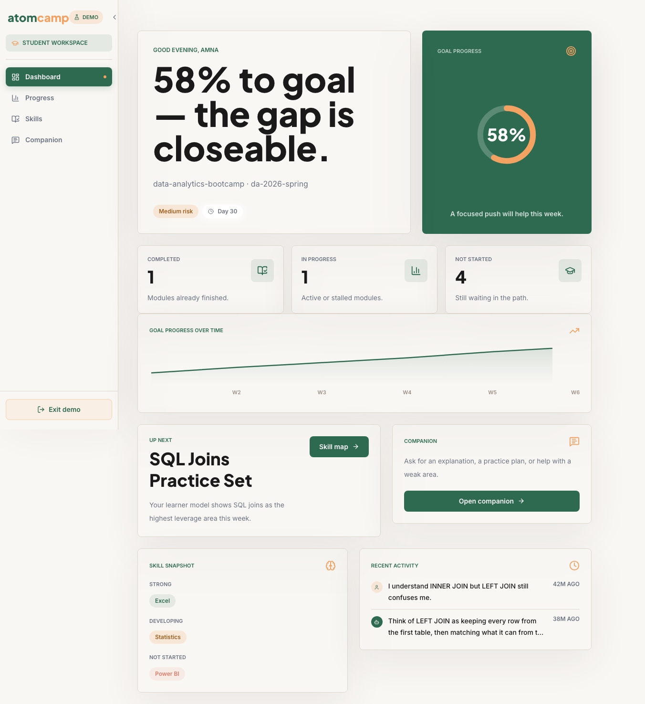
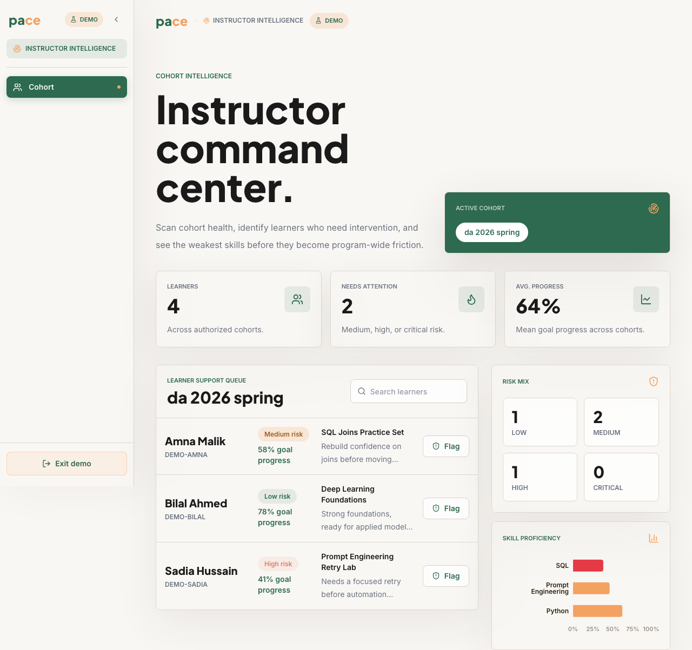
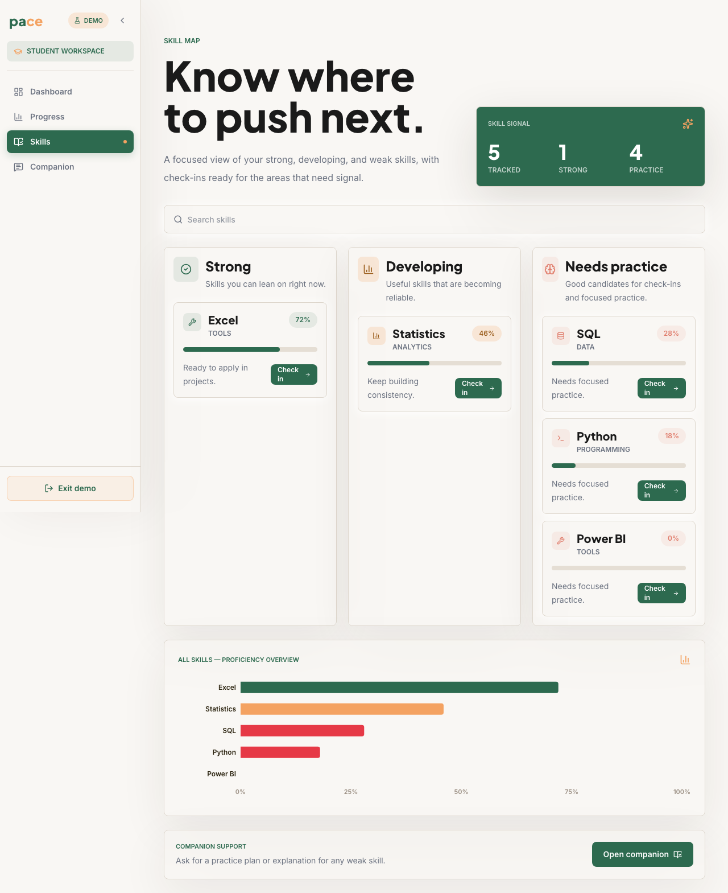
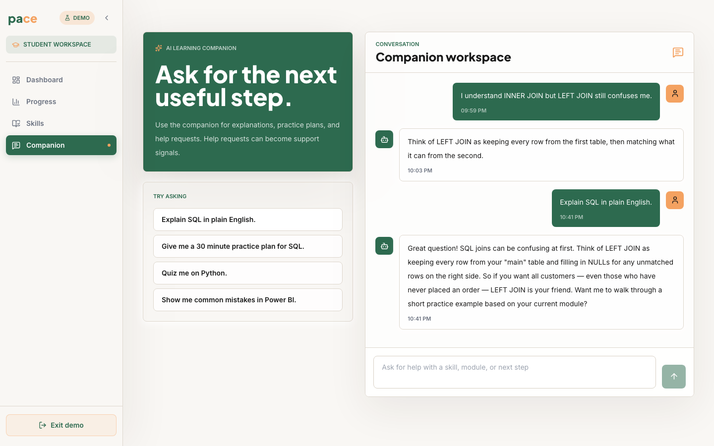
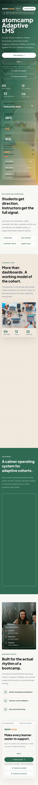
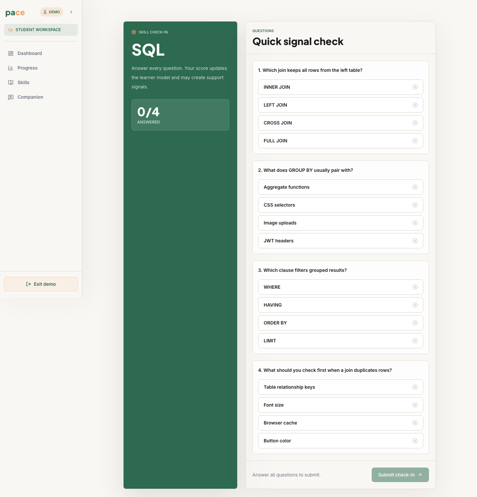
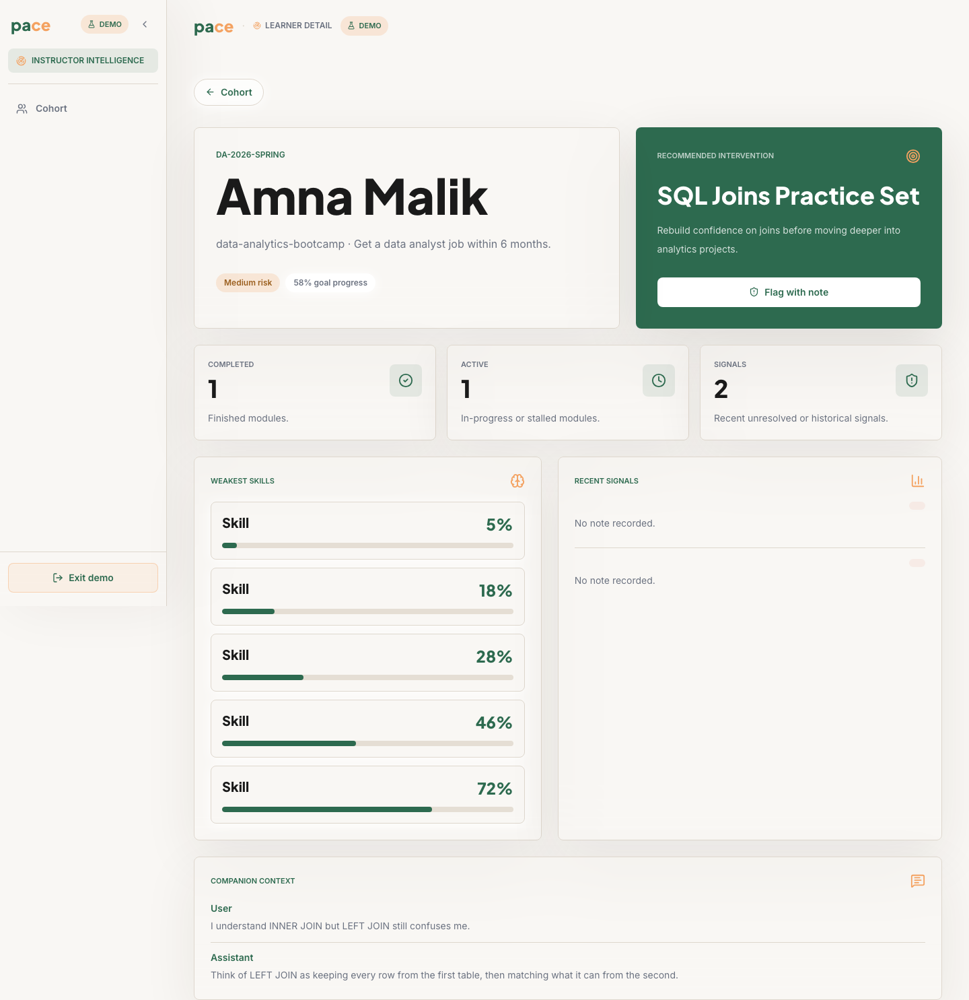

# pace — Adaptive LMS

> An open-source adaptive learning management system for cohort-based bootcamps — connecting student progress, instructor visibility, and timely support into one confident workspace.

[](./LICENSE)
[](#)
[](#)
[](#)
[](#)
[](./CONTRIBUTING.md)

---

## Demo

**No account needed.** Click "Explore as student" or "Explore as instructor" on the landing page — every screen works without a backend.

> 🎬 **[Watch the demo video (90 sec)](docs/demo.mp4)** — landing → student dashboard → skills → check-in → AI companion → instructor cohort → learner detail.

> **Try it instantly:** the landing page demo buttons drop you straight into either role — no signup, no backend, no config.

---

## Screenshots

| Landing | Student Dashboard | Instructor Cohort |
|:---:|:---:|:---:|
|  |  |  |

| Skills Map | AI Companion (Gemini) | Mobile View |
|:---:|:---:|:---:|
|  |  |  |

| Check-in Result | Learner Detail |
|:---:|:---:|
|  |  |

---

## What it is

**pace** is a full-stack application that models each student as a **living learner profile** — background, goals, skill confidence, module activity, check-ins, and companion conversations all feed a single model. The system uses that model to surface the right next action for the student and the right intervention signal for the instructor.

It is **not** a course delivery platform. It is the **adaptive intelligence layer** that wraps one — telling students what to work on next, and telling instructors which learners need attention before they fall behind.

---

## Who this is for

| You are... | How this helps you |
|---|---|
| **A bootcamp / cohort program** | Drop this on top of your existing content delivery. Get real-time risk signals and per-learner adaptive nudges without rebuilding your curriculum. |
| **An edtech startup** | Validated learner-model architecture you can fork, extend, and ship faster than building from scratch. |
| **A solo instructor** | Run it locally against a free Supabase project. Flag at-risk students before they disappear. |
| **A frontend / full-stack developer** | Clean Next.js 14 App Router codebase with a robust demo mode — study the patterns or contribute without a database. |
| **A researcher or ML engineer** | The rules engine and learner model are explicit and inspectable — no black-box scoring. Easy to swap in your own models via the LLM provider abstraction. |

---

## Key Features

**For students**
- Onboarding diagnostic that builds an initial learner profile (background, goal, confidence)
- Adaptive dashboard — goal-progress ring, dynamic headline based on risk state, next-best-action module card
- Skill map across strong / developing / weak / not-started bands with recharts proficiency bars
- Skill check-in (MCQ) that updates proficiency in real time with staggered result review
- AI learning companion powered by **Gemini 2.5 Flash** — context-aware starter prompts pulled from the learner profile, animated typing indicator, persistent conversation history
- Full demo mode — every screen works without a backend or login

**For instructors**
- Cohort command center: learner risk queue, risk-level mix chart, and skill proficiency heatmap
- At-risk learner list with signal reason explanations
- Manual flag + note workflow for learner interventions
- Learner detail view with full signal history and timeline

**Infrastructure**
- **Rules engine** — all adaptive thresholds (risk bands, inactivity windows, companion history length) live in one config, overridable via env or a live `rules_config` DB row — no deploy needed to tune behaviour
- Background signal sweep for inactivity detection (opt-in via env)
- Row-level security on Supabase with service-role bypass for the backend
- Persistent check-in sessions (DB-backed, survives restarts)
- Structured request logging, Helmet, rate limiting, Zod validation on every POST route
- Collapsible sidebar rail with Framer Motion animations (state persisted in `localStorage`)
- Global `:focus-visible` ring, `aria-hidden` on all decorative elements, focus-trapped modals

---

## Tech Stack

| Layer | Choice |
|---|---|
| Backend | Node.js 20+, Express 4 |
| Database | PostgreSQL via Supabase (free tier compatible) |
| Auth | Supabase Auth (JWT HS256, verified locally) |
| LLM | Google Gemini 2.5 Flash — deterministic rules fallback included |
| Frontend | Next.js 14 App Router |
| Styling | Tailwind CSS |
| Animation | Framer Motion |
| Charts | recharts |
| Icons | lucide-react |
| Typography | Inter (UI) · Plus Jakarta Sans (display) |
| Tests | Node.js built-in `node:test` — 420 tests, 0 failures |

---

## Project Structure

```
pace-lms/
├── backend/               # Express backend
│   ├── src/
│   │   ├── routes/         # student/* and instructor/* API surfaces
│   │   ├── services/       # business logic + rules engine
│   │   ├── db/
│   │   │   ├── repositories/   # Supabase data access
│   │   │   └── seeds/          # demo data seeder
│   │   ├── config/         # env, rules config, Supabase client
│   │   ├── middleware/     # auth, cohort scope, error handler
│   │   ├── jobs/           # signal sweep background job
│   │   └── lib/            # logger, validate middleware
│   └── migrations/         # SQL migrations 001–015
│
├── frontend/      # Next.js 14 frontend
│   ├── src/
│   │   ├── app/            # App Router pages (student/*, instructor/*, auth)
│   │   ├── components/
│   │   │   ├── AppShell.js # collapsible sidebar + demo badge
│   │   │   └── ui/         # Card, MetricCard, Button, RiskBadge, Modal, ProgressBar
│   │   ├── hooks/          # useFetch
│   │   └── lib/            # api.js, demoMode.js, demoData.js, constants.js, auth.js
│   └── DESIGN_LANGUAGE.md  # visual system reference
│
└── docs/
    ├── architecture.md     # system design, flows, data model
    ├── roadmap.md          # planned work
    └── screenshots/
```

---

## Getting Started

### Prerequisites

- Node.js 20+
- A [Supabase](https://supabase.com) project (free tier works)
- Google Gemini API key (optional — falls back to deterministic responses without it)

### 1. Clone

```bash
git clone https://github.com/Thyoldwizard/pace-adaptive-lms.git
cd pace-adaptive-lms
```

### 2. Backend

```bash
cd backend
cp .env.example .env
# Fill in: SUPABASE_URL, SUPABASE_SERVICE_ROLE_KEY, SUPABASE_JWT_SECRET
npm install
npm run migrate        # applies SQL migrations 001–015
npm run seed           # creates demo instructor + 3 student accounts
npm run dev            # http://localhost:3000
```

To enable real AI responses set `LLM_PROVIDER=gemini` and `GEMINI_API_KEY=your-key` in `.env`. Without a key the server falls back to deterministic responses automatically.

### 3. Frontend

```bash
cd frontend
cp .env.example .env.local
npm install
npm run dev            # http://localhost:3001
```

### 4. Demo mode (no backend needed)

Click **"Explore as student"** or **"Explore as instructor"** on the landing page. Every screen — dashboard, skill map, check-in, AI companion, instructor cohort — works without an account or a running backend. Useful for reviewing the UI or contributing frontend changes.

---

## API Overview

```
POST /api/auth/register
POST /api/auth/login
POST /api/auth/logout

GET  /api/student/dashboard
GET  /api/student/skills
GET  /api/student/onboarding/status
POST /api/student/onboarding/complete
POST /api/student/checkin/start/:skillCode
POST /api/student/checkin/submit/:skillCode
POST /api/student/companion

GET  /api/instructor/cohort
GET  /api/instructor/cohort/at-risk
GET  /api/instructor/cohort/heatmap
GET  /api/instructor/learner/:learnerId
POST /api/instructor/learner/:learnerId/flag
POST /api/instructor/jobs/sweep
```

Full request/response shapes are in [`docs/architecture.md`](docs/architecture.md).

---

## Demo Credentials

After running `npm run seed`:

| Role | Email | Password |
|---|---|---|
| Instructor | instructor@pace.test | Pace2026! |
| Student | amna.malik@pace.test | Pace2026! |
| Student | bilal.ahmed@pace.test | Pace2026! |
| Student | sadia.hussain@pace.test | Pace2026! |

---

## Project Status

**v0.1 — functionally complete.** All core features are shipped and running on a live Supabase instance.

| Area | Status |
|---|---|
| Backend API (B1–B12) | ✅ Complete — 420 tests passing |
| Frontend — all student screens | ✅ Complete |
| Frontend — all instructor screens | ✅ Complete |
| Demo mode (no backend/login) | ✅ Complete |
| Design system, sidebar, a11y | ✅ Complete |
| recharts charts (F6) | ✅ Complete |
| SEO (OG, Twitter card, theme-color) | ✅ Complete |
| Auth form polish | ✅ Complete |
| Screenshots (10) + demo video | ✅ Complete |
| Deployment docs (Vercel + Railway/Render) | 🔄 Planned (v0.2) |
| E2E tests (Playwright) | 🔄 Planned (v0.2) |
| Mobile-first layout audit | 🔄 Planned (v0.2) |
| Dark mode | 🔄 Planned (v0.3) |

Supabase free tier pauses on inactivity. Demo mode keeps the live portfolio usable regardless.

---

## Future Work

These are the areas where the project most needs community help:

### Good first issues
- **Accessibility audit** — run pages through a screen reader; find anything `aria-hidden` or focus order that's wrong
- **Documentation** — add JSDoc to service functions, extend `architecture.md` with deployment section
- **Animation preferences** — gate Framer Motion animations behind `prefers-reduced-motion`
- **Tests** — add Playwright E2E tests for the student registration → dashboard → check-in flow

### Intermediate
- **Mobile layout** — the sidebar rail collapses correctly but pages need a full small-screen pass (forms, skill cards, instructor table)
- **"Forgot password?" flow** — hook the stub to Supabase `resetPasswordForEmail`
- **Cohort selector memory** — persist the last-selected cohort in `localStorage`
- **Dark mode** — design tokens are already structured to support it; needs a system-preference toggle in the sidebar
- **OpenAI / Claude provider** — add to the existing LLM abstraction in `src/services/llm/`

### Ambitious
- **Localisation** — extract hardcoded strings into a thin i18n layer; Urdu is the primary market
- **Instructor notifications** — in-app alerts when a learner transitions to `high` or `critical` risk
- **Adaptive check-in difficulty** — use prior proficiency to select harder or easier questions
- **Prerequisite curriculum graph** — model skill dependencies so next-best-action can navigate around blockers
- **Multi-tenant isolation** — proper cohort ownership for different bootcamp operators on the same instance

See the full [`docs/roadmap.md`](docs/roadmap.md) for all planned work.

---

## Contributing

See [`CONTRIBUTING.md`](CONTRIBUTING.md) for setup, branch naming, and PR guidelines.

All sincere contributions are welcome — code, docs, design feedback, and issues. If you are planning something larger than a small change, open a GitHub issue first.

---

## Contributors

| Contributor | Role |
|---|---|
| [Sheikh Hassan](https://github.com/Thyoldwizard) | Project creator, product design, full-stack implementation |
| [Claude (Anthropic)](https://anthropic.com) | AI pair-programmer — architecture review, backend services, frontend implementation, open-source docs |

---

## Docs

- [`docs/architecture.md`](docs/architecture.md) — system design, flows, and data model
- [`docs/roadmap.md`](docs/roadmap.md) — planned work
- [`frontend/DESIGN_LANGUAGE.md`](frontend/DESIGN_LANGUAGE.md) — frontend visual system
- [`frontend/PAGE_MAP.md`](frontend/PAGE_MAP.md) — page-by-page product reference
- [SECURITY.md](SECURITY.md) — vulnerability reporting policy

---

## License

[MIT](LICENSE) — © 2026 pace contributors
